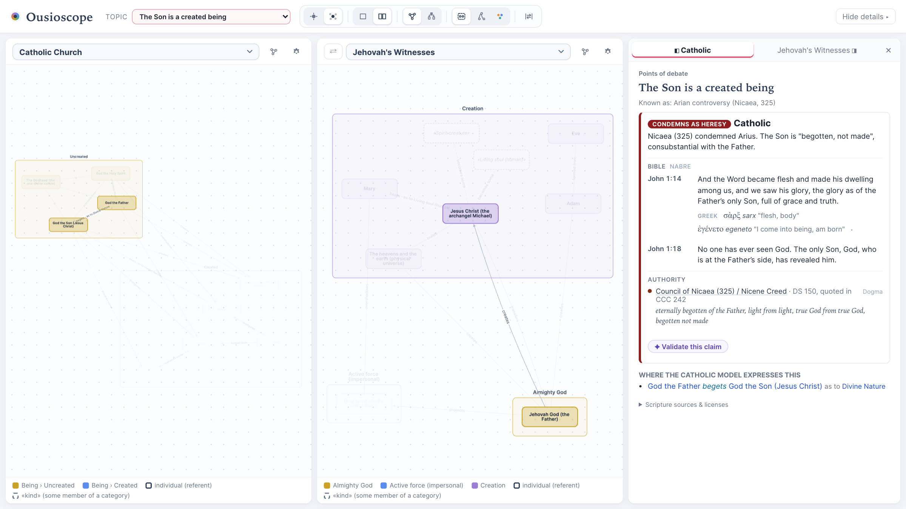

# Ousioscope

**What each tradition says things are.** Ousioscope (from Greek *ousia*, "being, substance") draws each religious
tradition's teaching as a graph of beings, kinds, and relationships. Every claim is in the tradition's own words
and is cited to its own sources. You can view one tradition, or compare two side by side.



*The Arian question in context: the Catholic model says the Father **begets** the Son; the Jehovah's Witnesses
model says Jehovah **creates** Jesus. The panel shows the Catholic stance (condemned as heresy at Nicaea) with its
scripture and authority.*

## What it does

- **Models six traditions**, each with its own vocabulary: the Catholic Church, The Church of Jesus Christ of
  Latter-day Saints, Presbyterian & Reformed (Westminster Standards), Jehovah's Witnesses, Sunni Islam, and Twelver
  Shia Islam.
- **Separates claims from categories.** The *model* holds named beings (God the Father, Jesus, Mary, Adam…) and the
  relationships a tradition asserts between them. The *metamodel* holds that tradition's kinds of being, how they
  nest, and which relationships connect them.
- **Cites everything.** Each claim carries its scripture (in the tradition's own translation, with Greek, Hebrew,
  or Arabic where the wording matters) and its authority (Catechism, Doctrine and Covenants, Westminster
  Confession, Watch Tower publications, tafsir, hadith), ranked by that tradition's own authority tiers.
- **Focuses on a topic.** Pick a subject (e.g. the Holy Spirit), a doctrine, a matter of salvation, or a point of
  debate (e.g. "God has a body"). Each graph narrows to the claims involved, or dims everything else.
- **Records stances on debates.** Eleven neutral propositions (the Trinity, the Arian question, Chalcedon, *Theotokos*,
  the *filioque*, creation from nothing, and more) have each tradition's cited stance: affirms, rejects, condemns,
  reframes, or no stated position, linked to the claims that express it.
- **Checks claims.** "Validate this claim" asks Gemini (with your own API key) whether a claim is faithful to the
  tradition's own sources, returning a verdict with direct quotes. Without a key, it opens the same research
  question in Google AI Mode.
- **Grows through agentic research.** A command-line workflow researches a topic blind, critiques the findings,
  and proposes validated data changes on a local branch for review.

### What it deliberately does not do

- **It does not judge which tradition is right.** It shows what each teaches, not whether it is true.
- **It does not force traditions into shared categories.** Traditions are connected only by the beings they talk
  about (referents) and the topics they address. Category correspondences live in an optional crosswalk layer that
  says where two categories part ways.
- **It does not invent proof texts.** Scripture appears only where the tradition's own authority cites it.
- **It does not rename a tradition's categories.** Each category's name is the tradition's own term, shown with a
  verbatim quote, unless it is marked as an editorial heading with a note explaining why.

## Quick start

Requirements: Node.js 20.19+ or 22.12+. Google Chrome is needed only for fetching scripture and for the research
workflow.

```bash
npm install
npm run dev        # validates the data, then starts the app (Vite prints the local URL)
```

Other commands:

| Command | What it does |
|---|---|
| `npm run validate` | Checks every data file: schema, integrity, citations, verse text, stance links, category names |
| `npm run check:terms` | Confirms online that each category's name appears on its quoted source page |
| `npm run build` | Validate, type-check, and build for production into `dist/` |
| `npm run fetch:scripture` | Fetches the exact text of any newly cited verse into `data/scripture/` |
| `npm run fetch:original` | Rebuilds the Greek and Hebrew notes from `data/scripture/original-curation.yaml` |
| `npm run research -- --topic <id>` | Runs the agentic research workflow (see below) |
| `npm run research:new -- --id <id> ...` | Bootstraps a new tradition with the same agent protocol |
| `npm run research:sweep -- --plan` | Previews the resumable subject-research backlog |
| `npm run test:research` | Runs offline research and merge-safety regression tests |

`fetch:scripture` and the research quote checker drive a local Google Chrome for some sites. Set `CHROME_PATH` if
Chrome isn't in the default macOS location.

## Using the app

- **Topic** (top bar): focus on a subject, doctrine, matter of salvation, life-and-worship topic, or point of
  debate.
- **Toolbar** (hover any icon for its definition): **Focus** (Isolate or In context), **Layout** (Single or
  Compare), **View** (Model or Metamodel), **Categories as** (boxes, nodes, or color), and **Crosswalk**.
- **Each canvas**: pick its tradition (⇄ swaps sides), set how many **degrees** out from the focused subject to
  show, re-run the **auto-layout**, or open **settings** to fade claims below an authority tier.
- **Detail panel**: click anything in a graph to see its category, topics, scripture, and authorities. Hovering a
  listed claim highlights it in the graph.
- **Sharing**: the URL keeps the current view, e.g.
  `?left=catholic&right=jw&topic=debate.son-created&fm=context`.

## How the data is organized

All content is YAML under `data/`, checked by a [zod](https://zod.dev) schema and a validator that runs before every
dev start and build.

```
data/
  referents.yaml              # the beings traditions talk about, with each tradition's names for them
  topics.yaml                 # shared topics and debate propositions
  crosswalks.yaml             # optional category correspondences between traditions
  scripture/<store>.yaml      # fetched verse text per translation (NABRE, KJV + Restoration, ESV, NWT, Qur'an)
  traditions/<id>/
    metamodel.yaml            # authority tiers, rule of interpretation, own outline, stances, categories, relationships
    model.yaml                # individuals and the relationships between them
```

Each tradition's scripture and main authorities:

| Tradition | Scripture | Main authorities |
|---|---|---|
| Catholic Church | NABRE (USCCB) | Catechism, councils (Denzinger), Aquinas |
| Latter-day Saints | KJV + Book of Mormon, Doctrine and Covenants, Pearl of Great Price | Standard works, official declarations, Church publications |
| Presbyterian & Reformed | ESV | Westminster Confession and Catechisms, with their proof texts |
| Jehovah's Witnesses | New World Translation | Watch Tower publications (jw.org, wol.jw.org) |
| Sunni Islam | Qur'an (Saheeh International, with Arabic) | Sahih hadith, Ibn Kathir's tafsir |
| Twelver Shia Islam | Qur'an (Qara'i, with Arabic) | al-Kafi (with gradings), scholarly creeds |

For the Islamic traditions, Bible passages appear only as labeled parallels, never as proof texts.

The full modeling and citation rules (one node per referent, atomic verbs, "as to" qualifiers, class-level
statements, authority tiers, allowed sources) are in [AGENTS.md](AGENTS.md).

## Research workflow

`npm run research` fills gaps in the data using headless [Antigravity CLI](https://antigravity.google/docs/cli/getting-started)
(`agy`) agents, all on one pinned Gemini Flash model:

1. A **blind researcher** reads the tradition's own sources without seeing the project's data.
2. **Code**, not a model, checks every quote against the live page and rejects sources outside the tradition's
   allowed sites.
3. A **reconciler** maps the findings onto the existing model.
4. A **critic** challenges them by the tradition's own standards and records internal disagreement.
5. A **judge** accepts or rejects each finding and writes structured changes.
6. The changes are applied, newly cited scripture is fetched, and the result must pass validation before it is
   committed to a local `research/<topic>-<stamp>` branch for review.

```bash
npm run research -- --topic ref.mary --traditions lds,sunni --dry-run   # research only, no file changes
npm run research -- --topic ref.mary --traditions lds,sunni             # commit to a local branch
```

Every prompt, finding, quote check, and a readable report are saved in `research/runs/<run-id>/`. See
[the research skill](.agents/skills/ousioscope-research/SKILL.md) for all options, including resuming a run
interrupted by a quota limit.

### Progressive local merges

With explicit permission to merge ongoing research, `npm run research:sweep` runs the current subject backlog and
Judaism correction in isolated worktrees, waiting for Gemini quota resets as needed. Each candidate must pass live
quote checks, validation, a final review of whether citations support the claims, and the build before a local
fast-forward merge into a clean `main`. It never pushes.

The resumable queue and timers are in `research/runs/progressive/state.json`; progress is in `progress.log` alongside.
New sourceable gaps return to research. Failed branches, repeated unresolved questions, and blocked jobs are retained
for review rather than silently discarded. Stop older research timers before starting this runner.

## Project structure

```
src/                 React + TypeScript app (Cytoscape.js graphs, detail panel, claim validator)
scripts/             validation, scripture fetchers, research workflow
data/                traditions, registries, scripture
AGENTS.md            modeling rules and conventions for contributors and coding agents
```

Built with Vite, React, TypeScript, Cytoscape.js (fcose layout), zod, and YAML.

## Contributing

Additions must follow the rules in [AGENTS.md](AGENTS.md): use the tradition's own vocabulary and sources, cite
every node and edge, and keep `npm run validate` passing. The research workflow is the easiest way to propose new
data; review its report before merging.

## License

The code and the project's own data are released under the [MIT License](LICENSE).

Scripture texts and translations remain the property of their publishers, and quoted authorities remain the
property of their authors. They are quoted here verse by verse for reference, with sources and licenses listed in
the app under "Scripture sources & licenses". The MIT License does not cover them.
